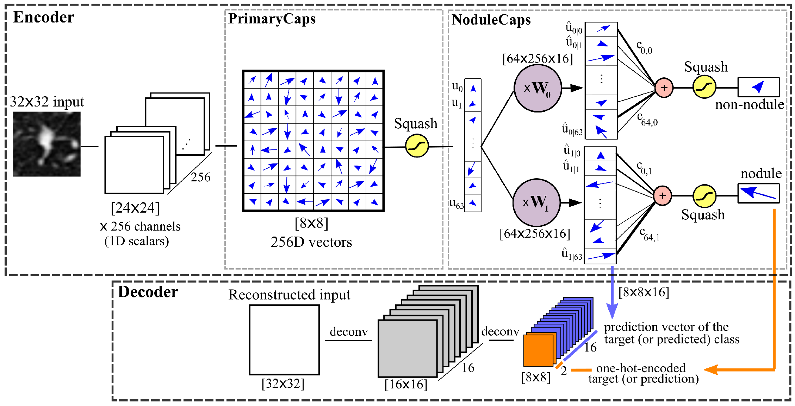

# Fast Capsule Network
Official TensorFlow implementation of the Fast Capsule Network proposed in 
the paper [Fast CapsNet for Lung Cancer Screening](https://arxiv.org/abs/1806.07416).


*Fig1. Fast Capsule Network architecture*


## Dependencies
- Python (2.7 preferably; also works fine with python 3)
- NumPy
- [Tensorflow](https://github.com/tensorflow/tensorflow)>=1.3
- Matplotlib (for saving images)


## How to run the code

### 1. Prepare your data
To run the code, you first need to store your data in a folder named 'data' inside the project folder. 
Given the current DataLoader code, it must be an HDF5 file containing train, validation and test sets. 


### 2. Train
Most of the network parameters can be found in ```config.py``` file. You may modify them or run with
the default values which runs the 3D Fast Capsule Network proposed in the paper.


Training the model displays the training results and saves the trained model after each epoch
if an improvement observed in the accuracy value.
- For training in the default setting: ```python main.py ```
- Loading the model and continue training: ```python main.py --reload_epoch=epoch_num``` 
where ```epoch_num``` determines th model number to be reload (e.g. is epoch_num=3, 
it will load the model trained and stored after 3 epochs).
- For training AlexNet network: 
```python main.py --model=alexnet --loss_type=cross_entropy --add_recon_loss=False```

### 3. Test:
- For running the test: ```python main.py --mode=test --reload_epoch=epoch_num```
where ```epoch_num``` determines th model number to be reload (e.g. is epoch_num=3, 
it will load the model trained and stored after 3 epochs).